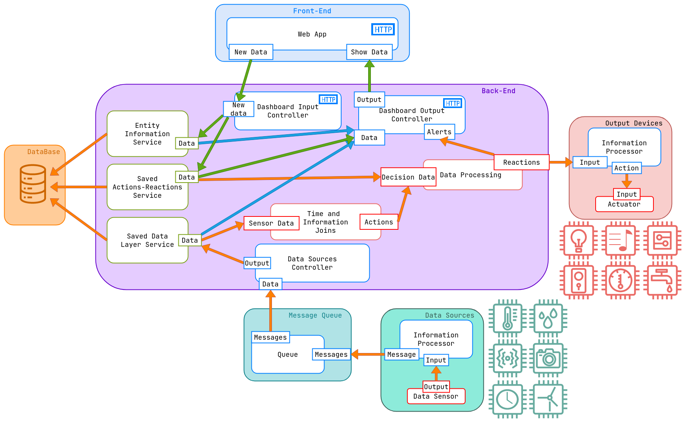

# My Sweet Home
## Our repository for the project of the IES class of 2023/2024 in UA

    

&nbsp;

## Description
### My Sweet Home   Home Automation Management System
 - Our aim with My Sweet Home is to develop a system where a user can associate input devices in his house to certain actions.
 - This project involves several receivers (inputs, such as thermostats, daylight-sensors, biometric-sensors, etc...) to be associated to output actions defined by the user and executed by a set of output devices.
 - The actions would be tailor made for each specific user and would need to verify if, for example, a user's action would interfere with another user's preference, like if a user turns on music at 11:00h but another user which we know is inside the same house doesn't want to be bothered by music until later.
 - One example of a simple task would be to close the windows if the temperature got too cold for the specification of the users inside the house, or to turn pass the music streaming of a user's phone to the house's speakers after he arrives home.
 - In the front-end we would be able to set these acttion-reaction pairs.

## Architecture Diagram

## Bookmarks

### Github repository
- https://github.com/zegameiro/IES_MySweetHome_G2
### Project Specification Report
- https://uapt33090-my.sharepoint.com/:w:/g/personal/rodrigoaguiar96_ua_pt/Eclxg-hVsX1AjO4ZlODAlHwBhfHHpHcjRj9Xb4AU41awEA
### Github Project
- https://github.com/users/zegameiro/projects/1
### API Documentation
- To be done
### Figma Mockup
- https://www.figma.com/file/1usB0nu0174e6QMF6IsxAc/My-Sweet-Home---IES?type=design&node-id=0%3A1&mode=design&t=O570V5XX2cdaccRS-1
### Figma Prototype
- https://www.figma.com/proto/1usB0nu0174e6QMF6IsxAc/My-Sweet-Home---IES?page-id=0%3A1&type=design&node-id=36-4&viewport=243%2C-92%2C0.16&t=fd7dMR9t0w2jyHMB-1&scaling=scale-down&starting-point-node-id=36%3A4&mode=design

## Our Team ✨

<!-- ALL-CONTRIBUTORS-LIST:START -->
<!-- prettier-ignore-start -->
<!-- markdownlint-disable -->
<table>
  <tr>
    <td align="center"><a href="https://github.com/P-Ramos16"> <b>Pedro Ramos</b> <i>107348</i></a>
<b>Architect</b> <a href="https://github.com/P-Ramos16" title="Code">💻</a> <a href="https://github.com/codesandbox/codesandbox-client/commits?author=CompuIves" title="Tests">⚠️</a> <a href="#tool-CompuIves" title="Tools">🔧</a></td>
    <td align="center"><a href="https://github.com/Dan1m4D"> <b>Daniel Madureira</b> <i>107603</i></a>
<b>Team Manager</b> <a href="https://github.com/Dan1m4D" title="Code">💻</a><a href="#design-CompuIves" title="Design">🎨</a><a href="#tool-CompuIves" title="Tools">🔧</a></td>
    <td align="center"><a href="https://github.com/zegameiro"> <b>José Gameiro</b> <i>108840</i></a>
<b>DevOps Master</b> <a href="https://github.com/zegameiro" title="Code">💻</a><a href="#blog-CompuIves" title="Blogposts">📝</a><a href="#tool-CompuIves" title="Tools">🔧</a></td>
    <td align="center"><a href="https://github.com/FiNeX96"> <b>Rodrigo Aguiar</b> <i>108969</i></a>
<b>Product Owner</b> <a href="https://github.com/FiNeX96" title="Code">💻</a><a href="#tool-MergeMaestro" title="Tools">🔀</a><a href="#tool-CompuIves" title="Tools">🔧</a></td>
  </tr>
</table>

<!-- markdownlint-enable -->
<!-- prettier-ignore-end -->

<!-- ALL-CONTRIBUTORS-LIST:END -->
