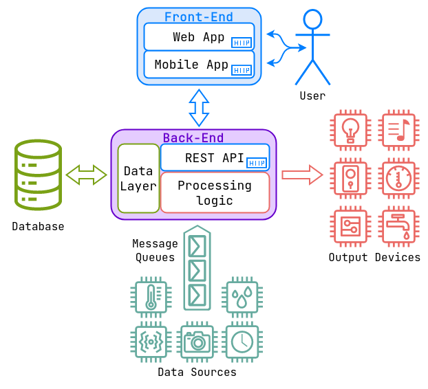
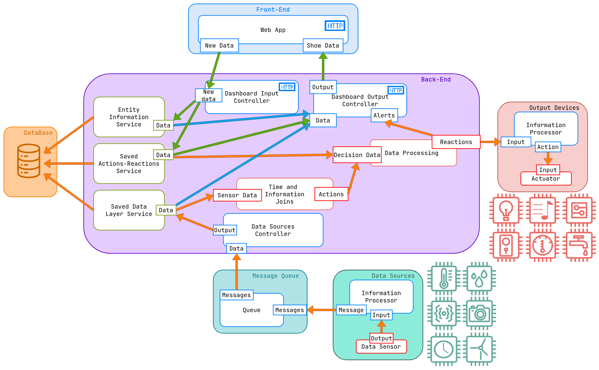
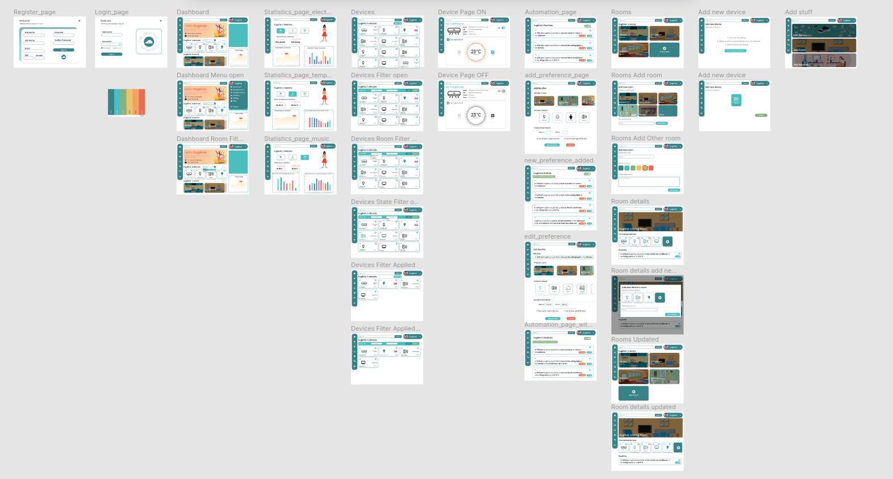
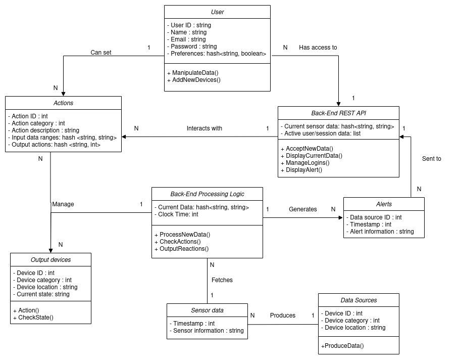
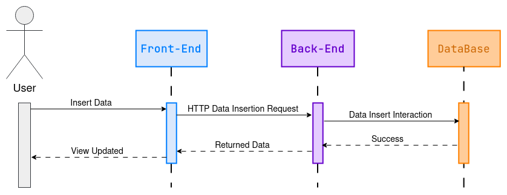
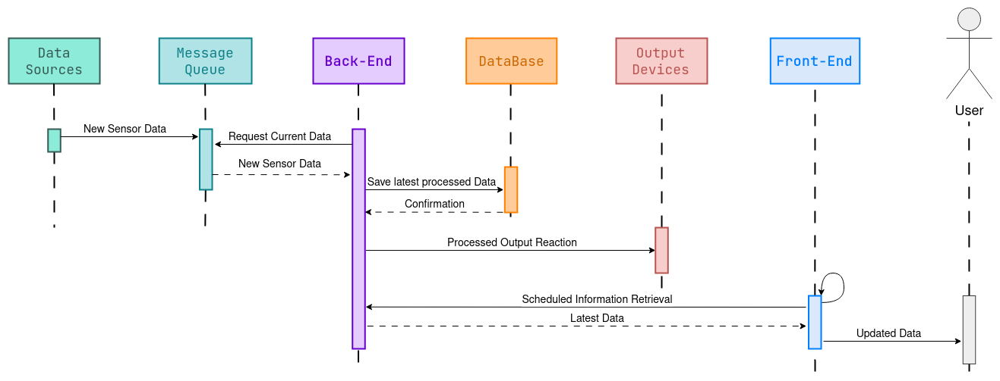
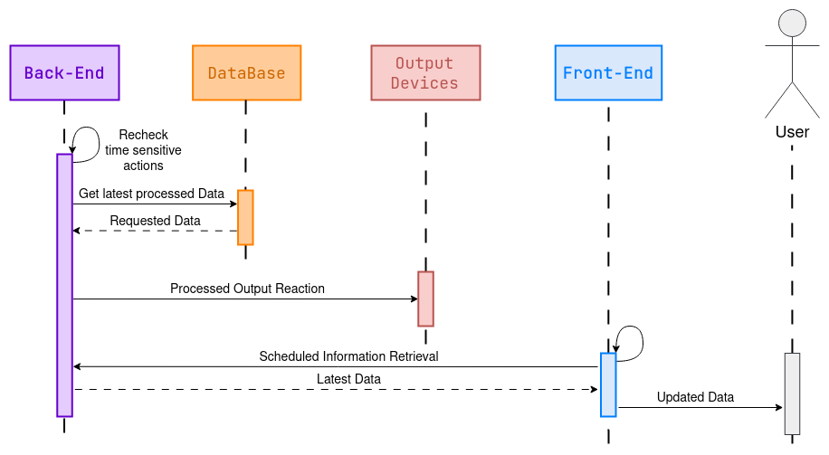

# My Sweet Home 
# Materials used in the presentations and report diagrams
This is the folder where we keep all presentation assets and diagrams made through out the duration of the project.
 

    

---

## Architecture Diagrams
### Simple architecture diagram

### Full architecture diagram

---

## Figma Prototypes
### Figma mockup
https://www.figma.com/file/1usB0nu0174e6QMF6IsxAc/My-Sweet-Home---IES?type=design&node-id=0%3A1&mode=design&t=O570V5XX2cdaccRS-1

### Figma Prototype
https://www.figma.com/proto/1usB0nu0174e6QMF6IsxAc/My-Sweet-Home---IES?page-id=0%3A1&type=design&node-id=36-4&viewport=243%2C-92%2C0.16&t=fd7dMR9t0w2jyHMB-1&scaling=scale-down&starting-point-node-id=36%3A4&mode=design

---

## Information Flux

---
## Sequence Diagrams
### Simple Front and Back end data communication for user input and control

### Time sensitive output reaction

### New sensor data input reaction

---

## Our Team ✨

<!-- ALL-CONTRIBUTORS-LIST:START -->
<!-- prettier-ignore-start -->
<!-- markdownlint-disable -->
<table>
  <tr>
    <td align="center" width="150px;"></td>
    <td align="center"><a href="https://github.com/P-Ramos16"> <b>Pedro Ramos</b> <i>107348</i></a>
<b>Architect</b> <a href="https://github.com/P-Ramos16" title="Code">💻</a> <a href="https://github.com/codesandbox/codesandbox-client/commits?author=CompuIves" title="Tests">⚠️</a> <a href="#tool-CompuIves" title="Tools">🔧</a></td>
    <td align="center"><a href="https://github.com/Dan1m4D"> <b>Daniel Madureira</b> <i>107603</i></a>
<b>Team Manager</b> <a href="https://github.com/Dan1m4D" title="Code">💻</a><a href="#design-CompuIves" title="Design">🎨</a><a href="#tool-CompuIves" title="Tools">🔧</a></td>
    <td align="center"><a href="https://github.com/zegameiro"> <b>José Gameiro</b> <i>108840</i></a>
<b>DevOps Master</b> <a href="https://github.com/zegameiro" title="Code">💻</a><a href="#blog-CompuIves" title="Blogposts">📝</a><a href="#tool-CompuIves" title="Tools">🔧</a></td>
    <td align="center"><a href="https://github.com/FiNeX96"> <b>Rodrigo Aguiar</b> <i>108969</i></a>
<b>Product Owner</b> <a href="https://github.com/FiNeX96" title="Code">💻</a><a href="#tool-MergeMaestro" title="Tools">🔀</a><a href="#tool-CompuIves" title="Tools">🔧</a></td>
    <td align="center" width="150px;"></td>
  </tr>
</table>

<!-- markdownlint-enable -->
<!-- prettier-ignore-end -->

<!-- ALL-CONTRIBUTORS-LIST:END -->
